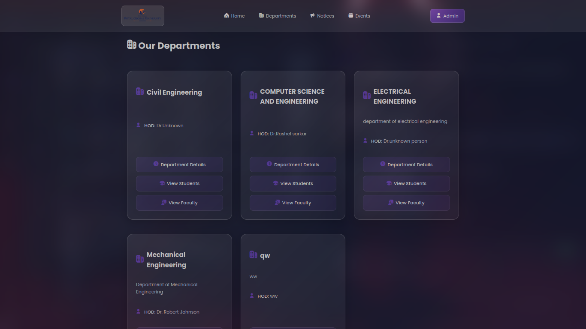
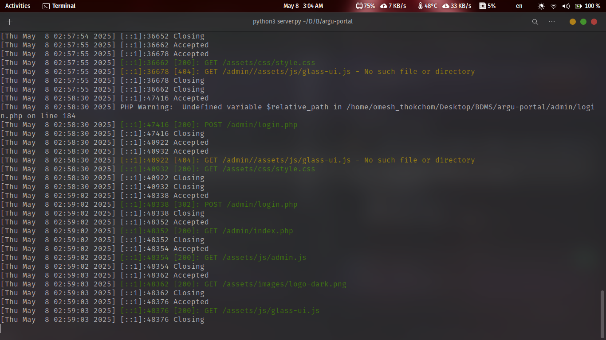
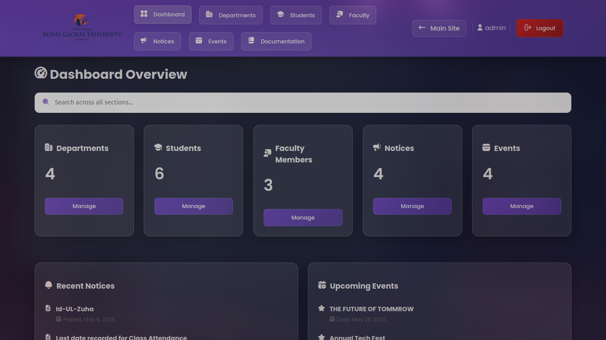

# RGU Portal

A comprehensive web-based portal system for Royal Global University, developed as a Database Management Systems (DBMS) course project.

## Project Status


## Screenshots

### CLIENT Dashboard


### Server Monitoring


### Admin Dashboard


## Project Information

### Academic Context
- **Course**: B.Tech Computer Science & Engineering
- **Semester**: 4th Semester
- **Subject**: Database Management Systems (DBMS)
- **Institution**: Royal Global University, Guwahati, Assam
- **Project Type**: Personal Academic Project
- **Project Duration**: 4th Semester (2025)
- **Project Start Date**: 7th may 2025
- **Project Completion Date**: 8th May 2025

### Developer
- **Name**: THOKCHOM DAYANANDA
- **Role**: Student Developer
- **GitHub**: [OmeshThokchom](https://github.com/OmeshThokchom)
- **Email**: thokchomdayananda54@gmail.com
- **huggingface**: [DayanandaThokchom](https://huggingface.co/DayanandaThokchom)


### Course Instructor
- **Name**: Dr. Sourabh
- **Department**: Computer Science & Engineering
- **Institution**: Royal Global University, Guwahati, Assam
- **Email**:


## Quick Start

### Prerequisites
- PHP 7.4+
- MySQL 5.7+

### Installation

1. Clone the repository:
```bash
git clone https://github.com/OmeshThokchom/RGU.git
cd RGU
```

2. Run setup script:
```bash
sudo ./setup.sh
or
bash setup.sh
```

The setup script will automatically:
- Create necessary directories
- Configure database with default settings
- Import database schema
- Set proper permissions

### Default Credentials

Database:
- Database Name: rgu_portal
- Database User: rgu_user
- Database Password: rgu_password123

Admin Access:
- Username: admin
- Password: admin123

- **NOTE : Change the default password after login.**

## Features

### 🎓 Academic Management
- Department organization
- Student records
- Faculty profiles
- Course tracking
- Academic calendar

### 📢 Communication
- Notice board system
- Event management
- Department announcements
- Important updates

### 🎨 Modern UI
- Glass morphism design
- Responsive layout
- Dark theme
- Interactive components

### 🔒 Security
- Secure authentication
- Role-based access
- Data encryption
- Activity logging
- Regular backups

## Implementation Details

### Database Design
- MySQL database implementation
- Normalized table structures
- Efficient indexing
- Referential integrity
- Transaction management

### Technical Stack
- PHP 7.4+
- MySQL 5.7+
- HTML5/CSS3
- JavaScript

## Documentation

- [User Guide](docs/user_guide.md)
- [Installation Guide](docs/installation_guide.md)
- [API Documentation](docs/api_documentation.md)
- [Development Standards](docs/development_standards.md)
- [Technical Guide](docs/technical_guide.md)

## Database Schema

### Core Tables
1. **departments**
   - Department information
   - HOD details
   - Course offerings

2. **students**
   - Student records
   - Academic history
   - Department association

3. **faculty**
   - Faculty profiles
   - Department assignment
   - Teaching load

4. **notices**
   - Announcements
   - Important updates
   - Department notices

5. **events**
   - Academic events
   - Department functions
   - University activities

## Academic Objectives

This project demonstrates proficiency in:
1. Database design and normalization
2. SQL query optimization
3. Transaction management
4. Web application development
5. System security implementation
6. Documentation practices

## License

This project is licensed under the MIT License - see the [LICENSE](LICENSE) file for details.

## Project Timeline
- **Start Date**: 4th Semester
- **Completion**: May 2025
- **Version**: 1.0.0

## Note
This project is a personal academic endeavor and is not intended for commercial use. All rights reserved to the developer. For any inquiries, please contact the developer via email or GitHub. This project is built with 60% of AI generated code. The AI generated code is not perfect and may contain errors. BTW, Overall this code is tested and working fine. The project is built with the help of ChatGPT and other AI tools. The developer is not responsible for any issues that may arise from the use of this code. Please use it at your own risk.